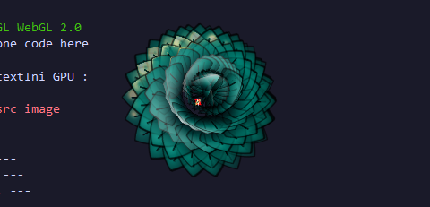
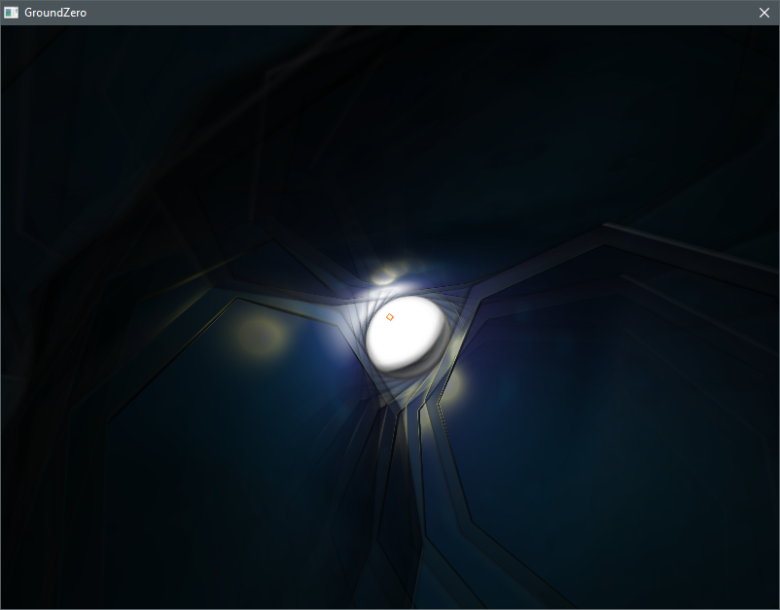
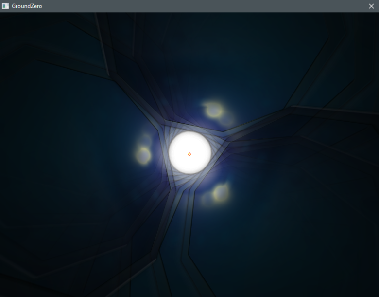

# GZE_Bush
Initially for a bush test, but these theses are more like a lotus flower

## [Bush1](https://cwc-gze.github.io/GZE_Bush/Test/Bush1/App.html)

## [Glass](https://cwc-gze.github.io/GZE_Bush/Test/Glass/App.html)

This one is done by mistake, but has a really nice effect (only the initial image of the leaf has been modified for the previous example)

